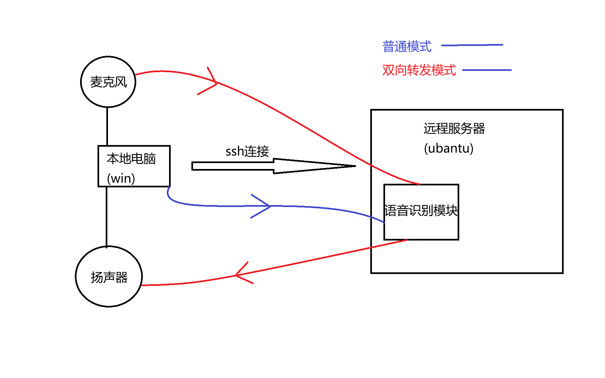
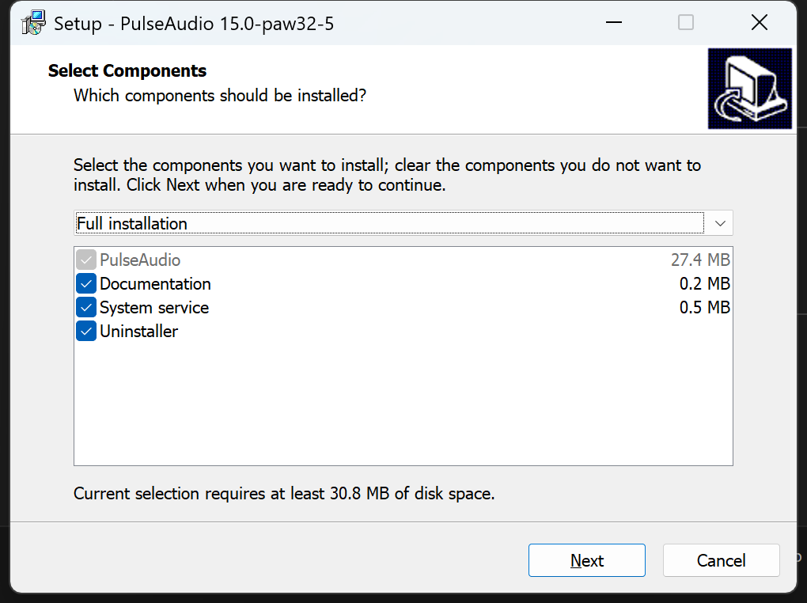
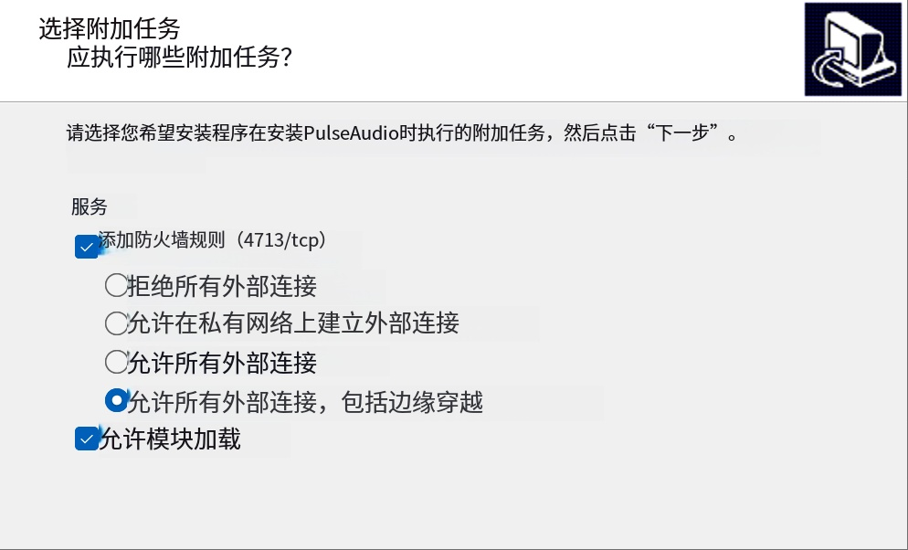

# 在ssh中,转发本地麦克风和远程声音
通过PulseAudio服务,将远程声音转发到本地,同时将本地麦克风转发到远程

> **提示**: 本教程中的部分构建过程源于本人另一个仓库 [ssh-x11-forwarding-guide](https://github.com/chiway-luo/ssh-x11-forwarding-guide.git)。

## 问题描述
在远程开发中,如涉及语音模块的开发与调试,未能将远程声音转发到本地,以及将本地麦克风转发到远程,会极大影响开发效率。

本教程将介绍如何通过PulseAudio服务,实现远程声音转发到本地,以及将本地麦克风转发到远程。

## 开发环境描述
- 本地操作系统: Windows 11
- 远程操作系统: Ubuntu 22.04(虚拟机)
## 下载工具
### windows端
- [PulseAudio Builds for Windows](https://pgaskin.net/pulseaudio-win32/)

```
下载完成后打开该安装程序,选择完整安装
```

```
允许所有外部连接
```


- 配置ssh连接config文件 (仅添加后两行参数)
```
Host remote_humble
  HostName *******
  Port ******
  User chiway
  ForwardX11 yes
  ForwardX11Trusted yes
  ExitOnForwardFailure yes  #确保转发失败时退出
  RemoteForward 4713 127.0.0.1:4713 #转发远程端口4713到本地端口4713
```

### ubuntu端

- 执行安装命令

```
sudo apt update
sudo apt install -y pulseaudio-utils
```
- 配置环境变量
```
sudo nano ~/.bashrc
```
```
#声音转发
export PULSE_SERVER=tcp:127.0.0.1:4713
```
- 重启ssh服务

## 到此为止,我们已经完成了远程声音转发到本地的配置
- 测试效果
```
paplay 任意音频.wav
```
## 配置麦克风转发到远程

- 查找远程声音设备
```
pactl list short sources
```
会看到一个类似 input / wavein 之类的 source
```
例如

0       wavein  ../../src/pulseaudio/src/modules/module-waveout.c       s16le 2ch 44100Hz       SUSPENDED
1       waveout.monitor ../../src/pulseaudio/src/modules/module-waveout.c       s16le 2ch 44100Hz       SUSPENDED
```
- 测试远程麦克风转发效果
```
把 <source_name> 换成上一步列出来的那个名字：

parec -d <source_name> --file-format=wav > mic.wav
```
对着本地麦克风说几秒钟，然后 Ctrl+C
```
paplay mic.wav
```
如果能听到你说话的声音,说明麦克风转发成功了
## 绑定“来自 Windows 的麦克风源”
在远程 Ubuntu 执行：
```
pactl list short sources
```
然后设为默认输入源（一次性）：
```
pactl set-default-source <你的source名>
```

## 补充
- 如果您需要在程序中使用麦克风输入,请确保程序使用的是默认输入源,或者直接指定为“来自 Windows 的麦克风源”。
- 播放远程声音时,请确保程序使用的是默认输出设备,或者直接指定为“来自 Windows 的扬声器设备”。

例如这段示例代码
```
system("paplay tts_sample.wav"); 
```
## 问题
当想使用远程的本地麦克风/扬声器时,需要将环境变量 PULSE_SERVER unset,才能使用远程的本地 麦克风输入/扬声器输出
将以下代码插入bashrc文件
```
#声音转发
#export PULSE_SERVER=tcp:127.0.0.1:4713 #注释掉默认转发到Windows的声音

# ---- PulseAudio 目标切换：远程本地 / 转发到Windows ----
local_mic() {
  unset PULSE_SERVER
  echo "[Pulse] 使用远程本地音频(含远程本地麦克风)，PULSE_SERVER 已 unset"
}
remote_mic() {
  export PULSE_SERVER="tcp:127.0.0.1:4713"
  echo "[Pulse] 使用转发到Windows的音频(本地扬声器/本地麦克风)，PULSE_SERVER=$PULSE_SERVER"
}
mic_check() {
  echo "PULSE_SERVER=${PULSE_SERVER:-<unset>}"
  pactl info 2>/dev/null | grep -E "Server String|Server Name" || true
}
```
# 到此为止设置结束,你就可以在远程开发环境中使用本地麦克风以及听到远程声音了